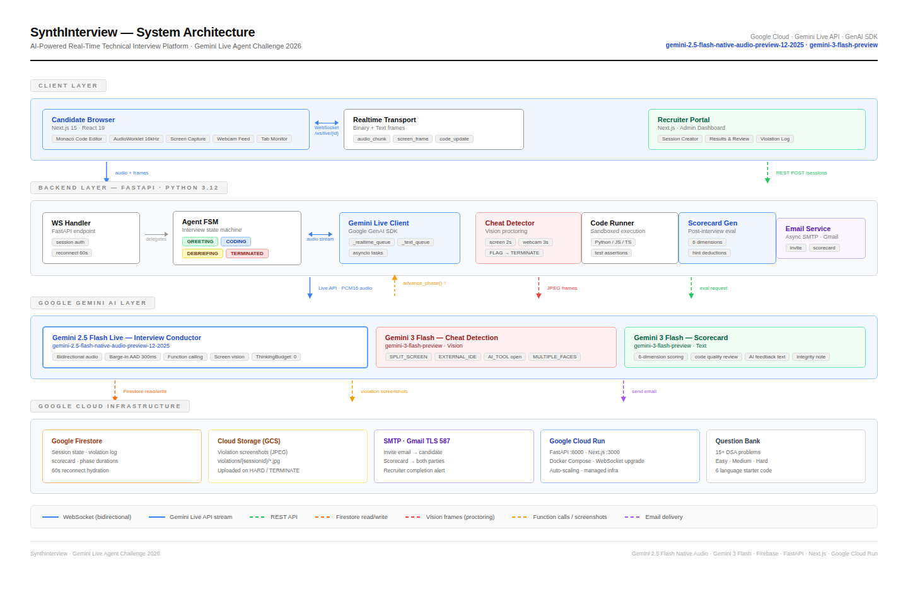

# SynthInterview

**AI-powered real-time technical interview platform**

SynthInterview conducts technical coding interviews autonomously. It watches the candidate's screen, listens to their explanations, and evaluates their solution in real time — then generates a structured scorecard the moment the session ends.

Built on the Gemini Live API for simultaneous audio and vision processing, it runs a complete interview from environment setup through optimization discussion without human intervention.

[](https://synthinterview.xyz/)
[](https://cloud.google.com)
[](https://ai.google.dev)

> Demo passcode: `SYNTH2025`

---

## What it does

- Conducts structured interviews through real-time voice conversation
- Watches the candidate's screen to follow their code as they write it
- Monitors session integrity and flags suspicious activity automatically
- Provides a browser-based code editor with multi-language support
- Generates a detailed scorecard covering code quality, approach, and communication

---

## Architecture



---

## Project structure

This is a monorepo managed with Turborepo.
```
SynthInterview/
├── apps/
│   ├── web/          # Next.js frontend — candidate interface and recruiter dashboard
│   └── api/          # FastAPI backend — AI orchestration and session state
├── packages/
│   └── types/        # Shared TypeScript definitions
├── cloudbuild.yaml   # Cloud Build CI/CD pipeline
└── deploy.sh         # GCP deployment script
```

---

## Getting started

### Prerequisites

| Tool   | Version | Install |
| ------ | ------- | ------- |
| Bun    | Latest  | [bun.sh](https://bun.sh/) |
| Python | 3.10+   | [python.org](https://www.python.org/) |
| uv     | Latest  | [astral.sh/uv](https://astral.sh/uv) |

### 1. Clone the repository
```bash
git clone https://github.com/prayagtushar/SynthInterview.git
cd SynthInterview
```

### 2. Configure environment variables

Copy the example files for each app and fill in the required values.
```bash
cp apps/web/.env.example apps/web/.env
cp apps/api/.env.example apps/api/.env
```

| Variable | Description | Where to get it |
| -------- | ----------- | --------------- |
| `GEMINI_API_KEY` | Gemini API access | [Google AI Studio](https://aistudio.google.com/app/apikey) |
| `FIREBASE_SERVICE_ACCOUNT_JSON` | Backend Firebase auth | Firebase Console → Service Accounts |
| `NEXT_PUBLIC_FIREBASE_*` | Frontend Firebase config | Firebase Console → Project Settings |
| `GCS_BUCKET_NAME` | Proctoring artifact storage | Google Cloud Console → Cloud Storage |
| `SMTP_*` | Session invite and scorecard emails | Optional |

### 3. Install dependencies and run

**macOS / Linux**
```bash
bun run setup:mac
bun run dev
```

**Windows (PowerShell)**
```powershell
bun run setup:windows
bun run dev
```

Both the frontend and backend start with a single `bun run dev` command.

### 4. Build for production
```bash
bun run build
```

---

## Live services

| Service  | URL |
| -------- | --- |
| Frontend | https://synth-interview-web-1082839508369.asia-south1.run.app |
| API      | https://synth-interview-api-1082839508369.asia-south1.run.app |

---

## Deployment

The project includes automated deployment to Google Cloud Run.
```bash
./deploy.sh
```

`cloudbuild.yaml` configures a Cloud Build trigger that builds and deploys automatically on every push to `main`.

---

## Tech stack

| Layer       | Technology |
| ----------- | ---------- |
| Frontend    | Next.js 15, React 19, Monaco Editor |
| Backend     | FastAPI, Python 3.12, Google GenAI SDK |
| AI          | Gemini 2.5 Flash Live, Gemini 2.5 Flash |
| Database    | Google Firestore |
| Storage     | Google Cloud Storage |
| Auth        | Firebase Auth |
| Hosting     | Google Cloud Run (asia-south1) |
| Tooling     | Turborepo, Bun, Docker, uv |

---

## License

This project is licensed under the MIT License. See [LICENSE](./LICENSE) for details.